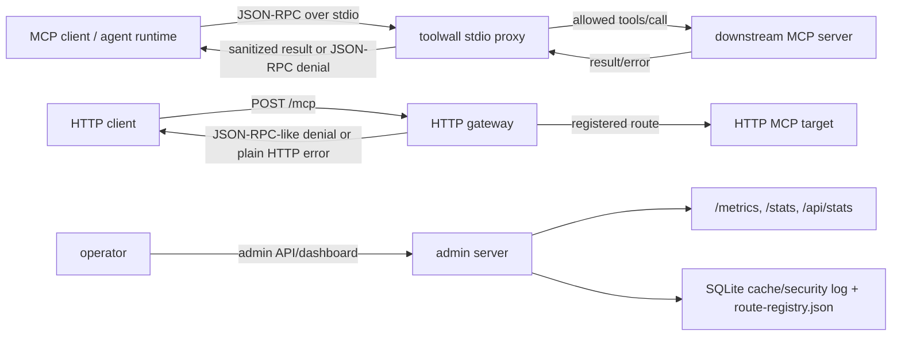

# Architecture

Toolwall is a local process boundary for MCP JSON-RPC traffic.

## Primary boundary

The primary boundary is `src/stdio/proxy.ts`.

Request flow:

1. read one JSON line from client stdin
2. parse JSON-RPC
3. inspect `tools/call` requests
4. apply trust gates before downstream execution
5. check rate limits and pending-request caps
6. use cache for eligible read/list/open/search calls
7. forward allowed requests to the downstream process
8. size-check downstream `result` or `error`
9. sanitize downstream payloads
10. write JSON-RPC output to client stdout

Non-`tools/call` JSON-RPC messages are proxied without trust-gate evaluation.

## Trust gates

| Gate | Source file | Failure behavior |
|---|---|---|
| NHI shared-secret auth | `src/middleware/nhi-auth-validator.ts` | deny |
| tool scope check | `src/middleware/scope-validator.ts` | deny |
| color boundary | `src/middleware/color-boundary.ts` and stdio equivalent | deny |
| AST egress filters | `src/middleware/ast-egress-filter.ts` | deny |
| preflight approval | `src/middleware/preflight-validator.ts` | deny |
| registered schema validation | `src/middleware/schema-validator.ts` | deny |
| per target/tool rate limit | `src/middleware/rate-limiter.ts` | deny |

If a gate cannot complete validation, the request is rejected instead of forwarded.

## Secondary surfaces

| Surface | Source file | Notes |
|---|---|---|
| HTTP `/mcp` gateway | `src/index.ts`, `src/cli.ts`, `src/proxy/router.ts` | compatibility gateway for registered routes |
| Admin API and dashboard | `src/admin/index.ts`, `ui/` | operational state and mutation endpoints |
| Prometheus metrics | `src/metrics/prometheus.ts` | exposed from admin server at `/metrics` |
| Embedded fallback MCP server | `src/embedded/server.ts` | status and usage tools when no target is configured |

HTTP `/mcp` reuses the same trust gates. JSON-RPC-like HTTP requests receive JSON-RPC error envelopes on failure.

## Persistence

| State | Location | Durable |
|---|---|---|
| L1 cache | process memory | no |
| L2 cache | SQLite under `MCP_CACHE_DIR` or `.mcp-cache` | yes |
| security event history | same SQLite database | yes, TTL/max-row bounded |
| route registry | `route-registry.json` under cache root | yes |
| preflight IDs | process memory | no |
| consumed preflight IDs | process memory | no |
| color-boundary session | process memory | no |
| tenant rate-limit overrides | process memory | no |

Docker Compose sets `MCP_CACHE_DIR=/data/.mcp-cache` and mounts `toolwall-data:/data`.

## Resource boundaries

| Boundary | Default |
|---|---:|
| HTTP JSON body limit | `1048576` bytes |
| stdio pending requests | `1000` |
| stdio JSON line size | `10485760` bytes |
| stdio serialized response payload | `5242880` bytes |
| target HTTP response payload | `5242880` bytes |
| sanitizer recursion depth | `20` |
| sanitizer array items | `1000` |
| sanitizer object keys | `1000` |
| sanitizer string regex input | `1048576` bytes |
| rate-limit keys | `10000` |
| audit log entry serialization | `16384` bytes |
